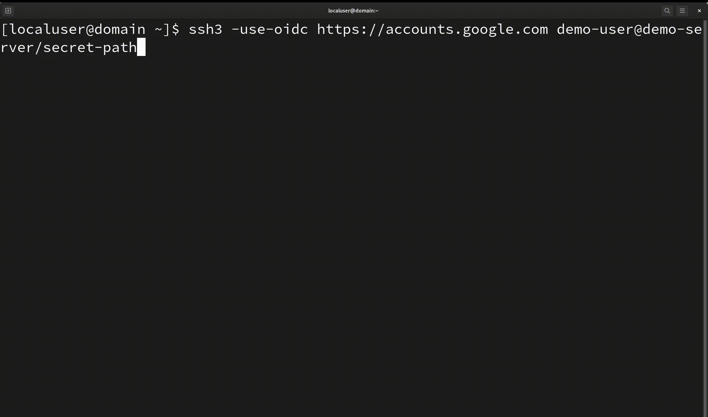

<div align=center>

</div>


# SSH3: faster and rich secure shell using HTTP/3
SSH3 is a complete revisit of the SSH
protocol, mapping its semantics on top of the HTTP mechanisms. It comes from our research work and we (researchers) recently proposed it as an [Internet-Draft](https://www.ietf.org/how/ids/) ([draft-michel-ssh3-00](https://www.ietf.org/archive/id/draft-michel-ssh3-00.html)).

In a nutshell, SSH3 uses [QUIC](https://datatracker.ietf.org/doc/html/rfc9000)+[TLS1.3](https://datatracker.ietf.org/doc/html/rfc8446) for
secure channel establishment and the [HTTP Authorization](https://www.rfc-editor.org/rfc/rfc9110.html#name-authorization) mechanisms for user authentication.
Among others, SSH3 allows the following improvements:
- Significantly faster session establishment
- New HTTP authentication methods such as [OAuth 2.0](https://datatracker.ietf.org/doc/html/rfc6749) and [OpenID Connect](https://openid.net/specs/openid-connect-core-1_0.html) in addition to classical SSH authentication
- Robustness to port scanning attacks: your SSH3 server can be made **invisible** to other Internet users
- UDP port forwarding in addition to classical TCP port forwarding
- All the features allowed by the modern QUIC protocol: including connection migration (soon) and multipath connections

> [!TIP]
> Quickly want to get started ? Checkout how to [install SSH3](#installing-ssh3). You will learn to [setup an SSH3 server](#deploying-an-ssh3-server) and [use the SSH3 client](#using-the-ssh3-client).

## ⚡ SSH3 is faster
Faster for session establishment, not throughput ! SSH3 offers a significantly faster session establishment than SSHv2. Establishing a new session with SSHv2 can take 5 to 7 network round-trip times, which can easily be noticed by the user. SSH3 only needs 3 round-trip times. The keystroke latency in a running session is unchanged.

<p align="center">

<i>SSH3 (top) VS SSHv2 (bottom) session establishement with a 100ms ping towards the server.</i>
</p>

## 🔒 SSH3 security
While SSHv2 defines its own protocols for user authentication and secure channel establishment, SSH3 relies on the robust and time-tested mechanisms of TLS 1.3, QUIC and HTTP. These protocols are already extensively used to secure security-critical applications on the Internet such as e-commerce and Internet banking.

SSH3 already implements the common password-based and public-key (RSA and EdDSA/ed25519) authentication methods. It also supports new authentication methods such as OAuth 2.0 and allows logging in to your servers using your Google/Microsoft/Github accounts.

### 🧪 SSH3 is still experimental
While SSH3 shows promise for faster session establishment, it is still at an early proof-of-concept stage. As with any new complex protocol, **expert cryptographic review over an extended timeframe is required before reasonable security conclusions can be made**.

We are developing SSH3 as an open source project to facilitate community feedback and analysis. However, we **cannot yet endorse its appropriateness for production systems** without further peer review. Please collaborate with us if you have relevant expertise!

### 🥷 Do not deploy the SSH3 server on your production servers for now
Given the current prototype state, we advise *testing SSH3 in sandboxed environments or private networks*. Be aware that making experimental servers directly Internet-accessible could introduce risk before thorough security vetting.

While [hiding](#-your-ssh3-public-server-can-be-hidden) servers behind secret paths has potential benefits, it does not negate the need for rigorous vulnerability analysis before entering production. We are excited by SSH3's future possibilities but encourage additional scrutiny first.

## 🥷 Your SSH3 public server can be hidden
Using SSH3, you can avoid the usual stress of scanning and dictionary attacks against your SSH server. Similarly to your secret Google Drive documents, your SSH3 server can be hidden behind a secret link and only answer to authentication attempts that made an HTTP request to this specific link, like the following:

    ssh3-server -bind 192.0.2.0:443 -url-path <my-long-secret>

By replacing `<my-long-secret>` by, let's say, the random value `M3MzkxYWMxMjYxMjc5YzJkODZiMTAyMjU`, your SSH3 server will only answer to SSH3 connection attempts made to the URL `https://192.0.2.0:443/M3MzkxYWMxMjYxMjc5YzJkODZiMTAyMjU` and it will respond a `404 Not Found` to other requests. Attackers and crawlers on the Internet can therefore not detect the presence of your SSH3 server. They will only see a simple web server answering 404 status codes to every request.

**NOTE WELL**: placing your SSH3 server behind a secret URL may reduce the impact of scanning attacks but will and must *never* replace classical authentication mechanisms. The secret link should only be used to avoid your host to be discovered. Knowing the secret URL should not grant someone access to your server. Use the classical authentication mechanisms described above to protect your server. 

## 💐 SSH3 is already feature-rich
SSH3 provides new feature that could not be provided by the SSHv2 protocol.

### Brand new features
- **UDP port forwarding**: you can now access your QUIC, DNS, RTP or any UDP-based server that are only reachable from your SSH3 host.
UDP packets are forwarded using QUIC datagrams.
- **X.509 certificates**: you can now use your classical HTTPS certificates to authenticate your SSH3 server. This mechanism is more secure than the classical SSHv2 host key mechanism. Certificates can be obtained easily using LetsEncrypt for instance.
- **Hiding** your server behind a secret link.
- **Keyless** secure user authentication using **OpenID Connect**. You can connect to your SSH3 server using the SSO of your company or your Google/Github account, and you don't need to copy the public keys of your users anymore.

### Famous OpenSSH features implemented
This SSH3 implementation already provides many of the popular features of OpenSSH, so if you are used to OpenSSH, the process of adopting SSH3 will be smooth. Here is a list of some OpenSSH features that SSH3 also implements:
- Parses `~/.ssh/authorized_keys` on the server
- Certificate-based server authentication
- `known_hosts` mechanism when X.509 certificates are not used.
- Automatically using the `ssh-agent` for public key authentication
- SSH agent forwarding to use your local keys on your remote server
- Direct TCP port forwarding (reverse port forwarding will be implemented in the future)
- Proxy jump (see the `-proxy-jump` parameter). If A is an SSH3 client and B and C are both SSH3 servers, you can connect from A to C using B as a gateway/proxy. The proxy uses UDP forwarding to forward the QUIC packets from A to C, so B cannot decrypt the traffic A<->C SSH3 traffic.
- Parses `~/.ssh/config` on the client and handles the `Hostname`, `User`, `Port` and `IdentityFile` config options (the other options are currently ignored). Also parses a new `UDPProxyJump` that behaves similarly to OpenSSH's `ProxyJump`.

## 🙏 Community support
Help us progress SSH3 responsibly! We welcome capable security researchers to review our codebase and provide feedback. Please also connect us with relevant standards bodies to potentially advance SSH3 through the formal IETF/IRTF processes over time.

With collaborative assistance, we hope to iteratively improve SSH3 towards safe production readiness. But we cannot credibly make definitive security claims without evidence of extensive expert cryptographic review and adoption by respected security authorities. Let's work together to realize SSH3's possibilities!

## Installing SSH3
You can either download the last [release binaries](https://github.com/francoismichel/ssh3/releases),
[install it using `go install`](#installing-ssh3-and-ssh3-server-using-go-install) or generate these binaries yourself by compiling the code from source.

> [!TIP]
> SSH3 is still experimental and is the fruit of a research work. If you are afraid of deploying publicly a new SSH3 server, you can use the
> [secret path](#-your-ssh3-public-server-can-be-hidden) feature of SSH3 to hide it behing a secret URL.

### Installing ssh3 and ssh3-server using Go install
```bash
go install github.com/francoismichel/ssh3/cmd/...@latest
```


### Compiling SSH3 from source
You need a recent [Golang](https://go.dev/dl/) version to do this.
Downloading the source code and compiling the binaries can be done with the following steps:

```bash
git clone https://github.com/francoismichel/ssh3    # clone the repo
cd ssh3
go build -o ssh3 cmd/ssh3/main.go                        # build the client
CGO_ENABLED=1 go build -o ssh3-server cmd/ssh3-server/main.go   # build the server, requires having gcc installed
```

If you have root/sudo privileges and you want to make ssh3 accessible to all you users,
you can then directly copy the binaries to `/usr/bin`:

```bash
cp ssh3 /usr/bin/ && cp ssh3-server /usr/bin
```

Otherwise, you can simply add the executables to your `PATH` environment variable by adding
the following line at the end of your `.bashrc` or equivalent:

```bash
export PATH=$PATH:/path/to/the/ssh3/directory
```

### Deploying an SSH3 server
Before connecting to your host, you need to deploy an SSH3 server on it. There is currently
no SSH3 daemon, so right now, you will have to run the `ssh3-server` executable in background
using `screen` or a similar utility.


> [!NOTE]
> As SSH3 runs on top of HTTP/3, a server needs an X.509 certificate and its corresponding private key. Public certificates can be generated automatically for your public domain name through Let's Encrypt using the `-generate-public-cert` command-line argument on the server. If you do not want to generate a certificate signed by a real certificate authority or if you don't have any public domain name, you can generate a self-signed one using the `-generate-selfsigned-cert` command-line argument. Self-signed certificates provide you with similar security guarantees to SSHv2's host keys mechanism, with the same security issue: you may be vulnerable to machine-in-the-middle attacks during your first connection to your server. Using real certificates signed by public certificate authorities such as Let's Encrypt avoids this issue.


Here is the usage of the `ssh3-server` executable:

```
Usage of ./ssh3-server:
  -bind string
        the address:port pair to listen to, e.g. 0.0.0.0:443 (default "[::]:443")
  -cert string
        the filename of the server certificate (or fullchain) (default "./cert.pem")
  -key string
        the filename of the certificate private key (default "./priv.key")
  -enable-password-login
        if set, enable password authentication (disabled by default)
  -generate-public-cert value
        Automatically produce and use a valid public certificate usingLet's Encrypt for the provided domain name. The flag can be used several times to generate several certificates.If certificates have already been generated previously using this flag, they will simply be reused without being regenerated. The public certificates are automatically renewed as long as the server is running. Automatically-generated IP public certificates are not available yet.
  -generate-selfsigned-cert
        if set, generates a self-self-signed cerificate and key that will be stored at the paths indicated by the -cert and -key args (they must not already exist)
  -url-path string
        the secret URL path on which the ssh3 server listens (default "/ssh3-term")
  -v    verbose mode, if set
  -version
        if set, displays the software version on standard output and exit
```

The following command starts a public SSH3 server on port 443 with a valid Let's Encrypt public certificate
for domain `my-domain.example.org` and answers to new sessions requests querying the `/ssh3` URL path:

    ssh3-server -generate-public-cert my-domain.example.org -url-path /ssh3

If you don't have a public domain name (i.e. only an IP address), you can either use an existing certificate
for your IP address using the `-cert` and `-key` arguments or generate a self-signed certificate using the
`-generate-selfsigned-cert` argument.

If you have existing certificates and keys, you can run the server as follows to use them=

    ssh3-server -cert /path/to/cert/or/fullchain -key /path/to/cert/private/key -url-path /ssh3

> [!NOTE]
> Similarly to OpenSSH, the server must be run with root priviledges to log in as other users.

#### Authorized keys and authorized identities
By default, the SSH3 server will look for identities in the `~/.ssh/authorized_keys` and `~/.ssh3/authorized_identities` files for each user.
`~/.ssh3/authorized_identities` allows new identities such as OpenID Connect (`oidc`) discussed [below](#openid-connect-authentication-still-experimental).
Popular key types such as `rsa`, `ed25519` and keys in the OpenSSH format can be used.

### Using the SSH3 client
Once you have an SSH3 server running, you can connect to it using the SSH3 client similarly to what
you did with your classical SSHv2 tool.

Here is the usage of the `ssh3` executable:

```
Usage of ssh3:
  -pubkey-for-agent string
        if set, use an agent key whose public key matches the one in the specified path
  -privkey string
        private key file
  -use-password
        if set, do classical password authentication
  -forward-agent
        if set, forwards ssh agent to be used with sshv2 connections on the remote host
  -forward-tcp string
        if set, take a localport/remoteip@remoteport forwarding localhost@localport towards remoteip@remoteport
  -forward-udp string
        if set, take a localport/remoteip@remoteport forwarding localhost@localport towards remoteip@remoteport
  -proxy-jump string
    	if set, performs a proxy jump using the specified remote host as proxy
  -insecure
        if set, skip server certificate verification
  -keylog string
        Write QUIC TLS keys and master secret in the specified keylog file: only for debugging purpose
  -use-oidc string
        if set, force the use of OpenID Connect with the specified issuer url as parameter
  -oidc-config string
        OpenID Connect json config file containing the "client_id" and "client_secret" fields needed for most identity providers
  -do-pkce
        if set, perform PKCE challenge-response with oidc
  -v    if set, enable verbose mode
```

#### Private-key authentication
You can connect to your SSH3 server at my-server.example.org listening on `/my-secret-path` using the private key located in `~/.ssh/id_rsa` with the following command:

      ssh3 -privkey ~/.ssh/id_rsa username@my-server.example.org/my-secret-path

#### Agent-based private key authentication
The SSH3 client works with the OpenSSH agent and uses the classical `SSH_AUTH_SOCK` environment variable to
communicate with this agent. Similarly to OpenSSH, SSH3 will list the keys provided by the SSH agent
and connect using the first key listen by the agent by default.
If you want to specify a specific key to use with the agent, you can either specify the private key
directly with the `-privkey` argument like above, or specify the corresponding public key using the
`-pubkey-for-agent` argument. This allows you to authenticate in situations where only the agent has
a direct access to the private key but you only have access to the public key.

#### Password-based authentication
While discouraged, you can connect to your server using passwords (if explicitly enabled on the `ssh3-server`)
with the following command:

      ssh3 -use-password username@my-server.example.org/my-secret-path

#### Config-based session establishment
`ssh3` parses your OpenSSH config. Currently, it only handles the `Hostname`; `User`, `Port` and `IdentityFile` OpenSSH options.
It also adds new option only used by SSH3, such as `URLPath` or `UDPProxyJump`. `URLPath` allows you to omit the secret URL path in your
SSH3 command. `UDPProxyJump` allows you to perform SSH3 (#proxy-jump)[Proxy Jump] and has the same meaning as the `-proxy-jump` command-line argument.
Let's say you have the following lines in your OpenSSH config located in `~/.ssh/config` :
```
IgnoreUnknown URLPath
Host my-server
  HostName 192.0.2.0
  User username
  IdentityFile ~/.ssh/id_rsa
  URLPath /my-secret-path
```

Similarly to what OpenSSH does, the following `ssh3` command will connect you to the SSH3 server running on 192.0.2.0 on UDP port 443 using public key authentication with the private key located in `.ssh/id_rsa` :

      ssh3 my-server/my-secret-path

If you do not want a config-based utilization of SSH3, you can read the sections below to see how to use the CLI parameters of `ssh3`.

#### OpenID Connect authentication (still experimental)
This feature allows you to connect using an external identity provider such as the one
of your company or any other provider that implements the OpenID Connect standard, such as Google Identity,
Github or Microsoft Entra. The authentication flow is illustrated in the GIF below.

<div align="center">


*Secure connection without private key using a Google account.*
</div>

The way it connects to your identity provider is configured in a file named `~/.ssh3/oidc_config.json`.
Below is an example `config.json` file for use with a Google account. This configuration file is an array
and can contain several identity providers configurations.
```json
[
    {
        "issuer_url": "https://accounts.google.com",
        "client_id": "<your_client_id>",
        "client_secret": "<your_client_secret>"
    }
]
```
This might change in the future, but currently, to make this feature work with your Google account, you will need to setup a new experimental application in your Google Cloud console and add your email as authorized users.
This will provide you with a `client_id` and a `client_secret` that you can then set in your `~/.ssh3/oidc_config.json`. On the server side, you just have to add the following line in your `~/.ssh3/authorized_identities`:

```
oidc <client_id> https://accounts.google.com <email>
```
We currently consider removing the need of setting the client_id in the `authorized_identities` file in the future.

#### Proxy jump
It is often the case that some SSH hosts can only be accessed through a gateway. SSH3 allows you to perform a Proxy Jump similarly to what is proposed by OpenSSH.
You can connect from A to C using B as a gateway/proxy. B and C must both be running a valid SSH3 server. This works by establishing UDP port forwarding on B to forward QUIC packets from A to C.
The connection from A to C is therefore fully end-to-end and B cannot decrypt or alter the SSH3 traffic between A and C.
